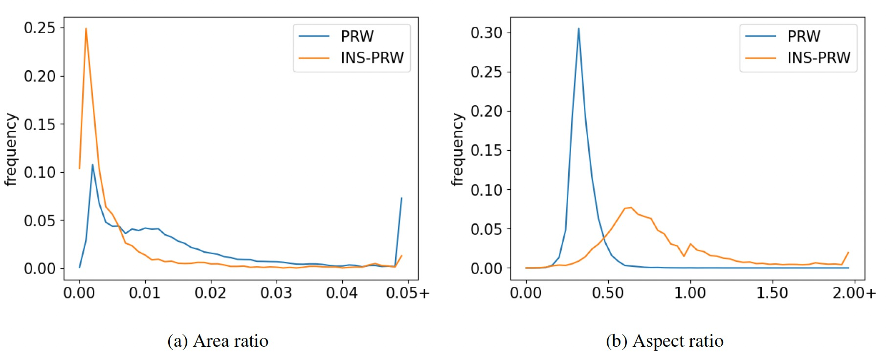

# Cycle Self-Training for Instance Search in Real World

This code has the source code for the paper "Cycle Self-Training for Instance Search in Real World Applications". Including:

* the annotation of INS-PRW

* the annotation of INS-CUHK-SYSU

## Annotation

### 1. Annotation description
* Please download original images from [CUHK-SYSU](https://github.com/ShuangLI59/person_search)[[2](#refer-anchor-2)] and [PRW](http://zheng-lab.cecs.anu.edu.au/Project/project_prw.html)[[3](#refer-anchor-3)]. Other information including the naming style, image size, etc., can be also found in the original project pages.

* We provide txt files for annotation in folder `annotation`. The annotation protocal is similar to PRW, `gallery.txt` and `query.txt` inlucde annotation with the format as [ID, left, top, right, bottom, image_name]. Only objects that pass through at least 2 cameras are taken into account.
  * The INS-PRW dataset has 7,834 bboxes for `INS_PRW_gallery.txt` and 1,537 bboxes for `INS_PRW_query.txt`.
  * The INS-CUHK-SYSU has 16,780 bboxes for `INS_CUHK_SYSU_gallery.txt` and 6,972 bboxes for `INS-CUHK_SYSU_query.txt`. `INS_CUHK_SYSU_local_gallery.txt` is the local distractor for each query, which is similar to the local gallery setting in original CUHK_SYSU.

### 2. Annotation Visualization
* Sample images from INS-PRW and INS-CUHK-SYSU are shown below. Note the `non saliency(great scale change)`, `class-agnostic`, `great view change` feature of the datasets.

  

### 3.Data Statics

* The statics of INS-PRW and INS-CUHK-SYSU are shown below.

| Name             | IDs  | Images | Bboxes | Qeuries |
| :--:             | :--: | :--:   | :--:   | :--:    |
| INS-PRW | 535 | 6,079  | 7,834  | 1,537    |
| INS-CUHK-SYSU | 6,972 | 9,648  | 16,780  | 6,972   |

* Distribution of normalized area and aspect ratio of the annotated boxes. From (a) and (c), the boxes occupy much smaller area in the full image compared with the person boxes, which means they are much harder to be localized. From (b) and (d), the aspect ratio distribution of the new annotated objects is more spreading out compared to those of person boxes, meaning that our objects are of wider variations.

  

* Category statistics of the two annotated datasets are shown below. Over 90% of the objects are excluded from VOC 20 classes as seen from (a) and (c). A significant portion of the objects do not belong to person accessories, meaning that they are not found being carried by a person.

  

## Evaluation
Given a query image with a bounding box, an instance search algorithm should produce multiple prediction boxes (with ranking scores) on the gallery frames. A prediction is regarded as true positive only if it has enough overlap (iou>0.5) with the ground truth bounding box which has the same ID as the query.

* Metrics
    * mAP: For each query, we calculate the area under the Precision-Recall curve, which is known as average precision(AP)[[1](#refer-anchor-1)]. Then the mean value of APs of all queries, i.e. mAP is obtained.
    * CMC: Cumulative Matching Characteristic, which shows the probability that a query object appears in deifferent-sized candidate lists. The calculation process is described in [[1](#refer-anchor-1)].

* Global gallery for INS-PRW: All gallery scene images are used for each query. The setting is identical to [[3](#refer-anchor-3)].

* Local gallery for INS-CUHK-SYSU: The local gallery distractors are added in INS_CUHK_SYSU_local_gallery.txt. Each query search in the local gallery set of 100 scene images (ground truth + local distractors). See [[2](#refer-anchor-2)] for details.

## Leardboard(rank-1/mAP)

We evaluate DELG[[4](#refer-anchor-4)], SiamRPN[[5](#refer-anchor-5)], GlobalTrack[[6](#refer-anchor-6)] and proposed methods in INS-CUHK-SYSU and INS-PRW datasets as follows:

| Method             | INS-CUHK-SYSU | INS-PRW   |
| :--:               | :--:          | :--:      |
| DELG               | 2.0(1.2)      | 0.0(0.0)  |
| SiamRPN            | 16.0(14.2)    | 0.0(0.0)  |
| GlobalTrack        | 28.4(27.8)    | 0.2(0.2)  |
| our baseline       | 43.1(42.1)    | 18.7(8.5) |
| our selftrain      | **47.4(45.9)** | **20.2(9.8)** |

* For more information, feel free to contact us at instance_search@163.com.

## Refenrence

[1] [Scalable Person Re-identification: A Benchmark](https://www.cv-foundation.org/openaccess/content_iccv_2015/papers/Zheng_Scalable_Person_Re-Identification_ICCV_2015_paper.pdf)

[2] [Joint Detection and Identification Feature Learning for Person Search](https://openaccess.thecvf.com/content_cvpr_2017/papers/Xiao_Joint_Detection_and_CVPR_2017_paper.pdf)

[3] [Person Re-identification in the Wild](https://openaccess.thecvf.com/content_cvpr_2017/papers/Zheng_Person_Re-Identification_in_CVPR_2017_paper.pdf)

[4] [Unifying deep local and global features for image search](https://arxiv.org/pdf/2001.05027.pdf)

[5] [High Performance Visual Tracking with Siamese Region Proposal Network](//openaccess.thecvf.com/content_cvpr_2018/papers/Li_High_Performance_Visual_CVPR_2018_paper.pdf)

[6] [GlobalTrack: A Simple and Strong Baseline for Long-term Tracking](https://arxiv.org/pdf/1912.08531.pdf)
